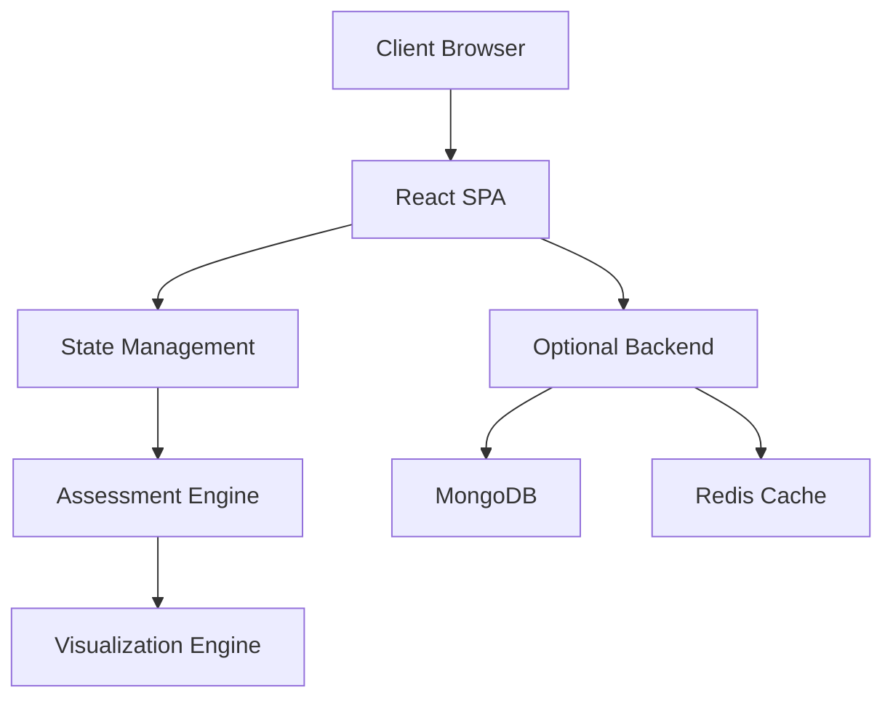

# Personality Mosaic Assessment System - Technical Specification

> **Important**: This document focuses on technical implementation details, architecture, and development requirements. For detailed content mappings, business logic, and content specifications, please refer to `content_spec.md`.

## Document Control

| Version | Date | Author | Changes |
|---------|------|---------|---------|
| v18.2 | 2025-05-21 | Senior Architecture Team | Enhanced technical clarity, improved structure |
| v18.1 | 2025-05-20 | Initial Team | Original specification |

## Table of Contents
1. [Project Overview](#1-project-overview)
2. [Technical Architecture](#2-technical-architecture)
3. [Frontend Implementation](#3-frontend-implementation)
4. [Backend Implementation](#4-backend-implementation)
5. [Database Design](#5-database-design)
6. [Testing Strategy](#6-testing-strategy)
7. [Deployment & DevOps](#7-deployment-devops)
8. [Security Requirements](#8-security-requirements)
9. [Performance Requirements](#9-performance-requirements)
10. [Monitoring & Logging](#10-monitoring-logging)
11. [Assessment Content Specifications](#11-assessment-content-specifications)
12. [Modular Report Generation System](#12-modular-report-generation-system)

## 1. Project Overview

### 1.1 Purpose
Create an engaging, scientifically-validated personality assessment system that identifies Enneagram types, wings, arrows, states, and subtypes through an interactive, gamified experience.

### 1.2 Technical Goals
- Create a responsive, accessible web application
- Ensure high performance and reliability
- Support offline functionality
- Maintain data privacy and security
- Enable easy extensibility and maintenance

### 1.3 System Requirements

#### Browser Support
- Chrome (latest 2 versions)
- Firefox (latest 2 versions)
- Safari (latest 2 versions)
- Edge (latest 2 versions)

#### Device Support
- Desktop (1920x1080 and above)
- Tablet (768px and above)
- Mobile (320px and above)

#### Performance Targets
- Initial load: < 2 seconds (90th percentile)
- Time to Interactive: < 3 seconds
- First Contentful Paint: < 1.5 seconds
- Core Web Vitals compliance

## 2. Technical Architecture

### 2.1 Technology Stack

#### Frontend
- React 18.x
- TypeScript 5.x
- Zustand for state management
- TailwindCSS for styling
- Framer Motion for animations
- Jest + React Testing Library for testing

#### Backend (Optional)
- Node.js 20.x
- Express 4.x
- MongoDB 6.x
- Redis for caching

### 2.2 System Architecture



### 2.3 Core Components

#### Assessment Engine
- Handles personality type calculations
- Manages assessment state
- Processes user responses
- Generates results

#### Visualization Engine
- Renders interactive tower
- Manages animations
- Handles user interactions
- Generates final report

## 3. Frontend Implementation

### 3.1 State Management

> **Content Reference**: For detailed content mappings and business logic for each state, see `content_spec.md` Section 1.3 (Color Palette Content).

```typescript
// Core State Interface
interface AssessmentState {
  currentPhase: 'foundation' | 'building' | 'color' | 'detail' | 'results';
  userProgress: {
    foundationSelections: number[];
    blockSelections: number[];
    stateSelections: number[];
    subtypeDistribution: {
      self: number;
      oneToOne: number;
      social: number;
    };
  };
  results: {
    primaryType: string;
    wing: string;
    states: {
      primary: string;
      secondary: string;
      distribution: number[];
    };
    subtypes: {
      dominant: string;
      secondary: string;
      tertiary: string;
    };
  };
}

// Zustand Store Configuration
interface AssessmentStore extends AssessmentState {
  setPhase: (phase: AssessmentState['currentPhase']) => void;
  updateSelections: (phase: string, selections: number[]) => void;
  calculateResults: () => void;
  resetAssessment: () => void;
}
```

### 3.2 Component Architecture

> **Content Reference**: For detailed interaction patterns and content requirements, see `content_spec.md` Section 3.1 (Interaction Patterns).

```typescript
// Base Component Interface
interface AssessmentComponentProps {
  onComplete: () => void;
  onBack: () => void;
  isActive: boolean;
  data?: any;
}

// Phase-specific Components
interface FoundationPhaseProps extends AssessmentComponentProps {
  stones: Stone[];
  onSelection: (stoneId: number) => void;
}

interface BuildingPhaseProps extends AssessmentComponentProps {
  blocks: Block[];
  onBlockSelection: (blockId: number) => void;
}

// ... Additional interfaces for other phases
```

### 3.3 Routing Structure

```typescript
const routes = [
  {
    path: '/',
    component: Welcome,
    exact: true,
  },
  {
    path: '/assessment',
    component: AssessmentContainer,
    routes: [
      {
        path: '/assessment/foundation',
        component: FoundationPhase,
      },
      {
        path: '/assessment/building',
        component: BuildingPhase,
      },
      // ... Additional routes
    ],
  },
  {
    path: '/results',
    component: Results,
  },
];
```

## 4. Backend Implementation

### 4.1 API Endpoints

> **Content Reference**: For content translation and mapping requirements, see `content_spec.md` Section 4.1 (Content Translation Framework).

```typescript
// API Routes
interface APIRoutes {
  assessment: {
    start: '/api/v1/assessment/start' // POST
    save: '/api/v1/assessment/save'   // POST
    results: '/api/v1/assessment/results' // GET
  }
  user: {
    create: '/api/v1/user'           // POST
    profile: '/api/v1/user/profile'  // GET
    update: '/api/v1/user/update'    // PUT
  }
}

// API Response Interface
interface APIResponse<T> {
  success: boolean;
  data?: T;
  error?: {
    code: string;
    message: string;
    details?: any;
  };
}
```

### 4.2 Error Handling

```typescript
// Error Types
enum ErrorType {
  VALIDATION_ERROR = 'VALIDATION_ERROR',
  AUTH_ERROR = 'AUTH_ERROR',
  SERVER_ERROR = 'SERVER_ERROR',
  NOT_FOUND = 'NOT_FOUND',
}

// Error Handler
const errorHandler = (error: Error): APIResponse<null> => {
  switch (error.name) {
    case ErrorType.VALIDATION_ERROR:
      return {
        success: false,
        error: {
          code: 'VALIDATION_ERROR',
          message: error.message,
        },
      };
    // ... Handle other error types
  }
};
```

## 5. Database Design

### 5.1 Schema Definition

> **Content Reference**: For detailed content relationships and data structures, see `content_spec.md` Section 2.1 (Type Determination Algorithm).

```typescript
// User Schema
interface User {
  _id: ObjectId;
  email: string;
  name: string;
  assessments: Assessment[];
  createdAt: Date;
  updatedAt: Date;
}

// Assessment Schema
interface Assessment {
  _id: ObjectId;
  userId: ObjectId;
  responses: {
    phase: string;
    selections: number[];
  }[];
  results: AssessmentResults;
  startedAt: Date;
  completedAt: Date;
}

// Indexes
db.users.createIndex({ email: 1 }, { unique: true });
db.assessments.createIndex({ userId: 1, completedAt: -1 });
```

### 5.2 Data Access Patterns

```typescript
// Data Access Layer
class AssessmentDAO {
  async create(userId: string): Promise<Assessment>;
  async update(id: string, data: Partial<Assessment>): Promise<Assessment>;
  async getByUser(userId: string): Promise<Assessment[]>;
  async getResults(id: string): Promise<AssessmentResults>;
}
```

## 6. Testing Strategy

### 6.1 Testing Requirements

- Unit test coverage: minimum 80%
- Integration test coverage: minimum 60%
- E2E test coverage: critical user paths
- Performance testing: load and stress tests
- Accessibility testing: WCAG 2.1 AA compliance

### 6.2 Test Implementation

```typescript
// Example Test Suite
describe('Assessment Engine', () => {
  describe('Type Calculation', () => {
    it('should correctly calculate primary type', () => {
      const selections = [1, 2, 3, 1, 2];
      const result = calculateType(selections);
      expect(result.primaryType).toBeDefined();
    });
  });
});
```

## 7. Deployment & DevOps

### 7.1 CI/CD Pipeline

```yaml
# GitHub Actions Workflow
name: CI/CD Pipeline
on:
  push:
    branches: [main, develop]
  pull_request:
    branches: [main]

jobs:
  test:
    runs-on: ubuntu-latest
    steps:
      - uses: actions/checkout@v2
      - name: Install dependencies
        run: npm ci
      - name: Run tests
        run: npm test
      - name: Build
        run: npm run build
```

### 7.2 Environment Configuration

```typescript
// Environment Variables
interface EnvironmentConfig {
  NODE_ENV: 'development' | 'staging' | 'production';
  API_URL: string;
  DATABASE_URL: string;
  REDIS_URL?: string;
  LOG_LEVEL: 'debug' | 'info' | 'warn' | 'error';
}
```

## 8. Security Requirements

### 8.1 Authentication & Authorization

- JWT-based authentication
- Role-based access control
- Session management
- CSRF protection
- Rate limiting

### 8.2 Data Protection

- Data encryption at rest
- Secure communication (HTTPS)
- Input validation
- XSS prevention
- SQL injection prevention

## 9. Performance Requirements

### 9.1 Frontend Performance

- Bundle size < 250KB (gzipped)
- First Contentful Paint < 1.5s
- Time to Interactive < 3s
- Frame rate > 60fps for animations

### 9.2 Backend Performance

- API response time < 200ms (95th percentile)
- Database query time < 100ms
- Cache hit ratio > 80%
- Maximum concurrent users: 10,000

## 10. Monitoring & Logging

### 10.1 Monitoring Metrics

- User engagement metrics
- Error rates and types
- Performance metrics
- System health metrics

### 10.2 Logging Requirements

```typescript
// Log Levels
enum LogLevel {
  DEBUG = 'debug',
  INFO = 'info',
  WARN = 'warn',
  ERROR = 'error',
}

// Log Entry Interface
interface LogEntry {
  timestamp: Date;
  level: LogLevel;
  message: string;
  context: {
    userId?: string;
    sessionId?: string;
    action?: string;
    error?: Error;
  };
}
```

## 11. Assessment Content Specifications

### 11.1 Foundation Stone Content

#### 11.1.1 Stone Set Definitions
```typescript
interface StoneSet {
  id: number;
  theme: string;
  stones: Stone[];
}

interface Stone {
  id: number;
  values: string[];
  gradient: string;
  mappingWeight: number;
}

const stoneSets: StoneSet[] = [
  {
    id: 1,
    theme: "Decision Center",
    stones: [
      {
        id: 1,
        values: ["THINKING", "ANALYSIS", "LOGIC"],
        gradient: "blue",
        mappingWeight: 2.0
      },
      // ... other stones
    ]
  },
  // ... other sets
];
```

#### 11.1.2 Type Mapping Algorithm
```typescript
function determinePersonalityType(selections: number[]): TypeResult {
  const typeScores = initializeTypeScores();
  const setWeights = [2.0, 2.5, 1.5, 1.0, 1.0, 1.5, 1.0, 1.0, 1.0];
  
  selections.forEach((selection, index) => {
    applySelectionScore(typeScores, selection, setWeights[index]);
  });
  
  return calculateFinalType(typeScores);
}
```

### 11.2 Building Block Content

#### 11.2.1 Block Pair Definitions
```typescript
interface BlockPair {
  id: number;
  theme: string;
  blocks: Block[];
  typeSpecific: boolean;
}

interface Block {
  id: number;
  description: string;
  implication: string;
  weight: number;
}

const blockPairs: Record<number, BlockPair[]> = {
  1: [
    {
      id: 1,
      theme: "Wing Determination",
      blocks: [
        {
          id: 1,
          description: "I seek peace and maintain calm while upholding standards",
          implication: "1w9",
          weight: 1.5
        },
        // ... other blocks
      ],
      typeSpecific: true
    },
    // ... other pairs
  ],
  // ... other types
};
```

### 11.3 Color Palette Specifications

#### 11.3.1 State Colors
```typescript
interface StateColor {
  name: string;
  colors: {
    primary: string;
    light: string;
    dark: string;
  };
}

const stateColors: StateColor[] = [
  {
    name: "Very Good",
    colors: {
      primary: "#22c55e",
      light: "#4ade80",
      dark: "#166534"
    }
  },
  // ... other states
];
```

### 11.4 Detail Element Specifications

#### 11.4.1 Subtype Container Definitions
```typescript
interface SubtypeContainer {
  id: string;
  title: string;
  description: string;
  typeSpecific: boolean;
}

const subtypeContainers: Record<number, SubtypeContainer[]> = {
  1: [
    {
      id: "self",
      title: "🛡️ Self-Preservation -- Inner Tension",
      description: "You manage stress by focusing on routines and doing things the right way...",
      typeSpecific: true
    },
    // ... other containers
  ],
  // ... other types
};
```

## 12. Modular Report Generation System

### 12.1 Content Translation Framework

#### 12.1.1 State Translation Mapping
```typescript
interface StateTranslation {
  enneagramState: string;
  heartActivation: string;
  range: [number, number];
}

const stateTranslations: StateTranslation[] = [
  {
    enneagramState: "Very Good",
    heartActivation: "Fully Activated Heart State",
    range: [80, 100]
  },
  // ... other states
];
```

#### 12.1.2 Type Translation Mapping
```typescript
interface TypeTranslation {
  enneagramType: number;
  energyPattern: string;
  characteristics: string[];
}

const typeTranslations: TypeTranslation[] = [
  {
    enneagramType: 1,
    energyPattern: "Integrity-Driven Excellence Pattern",
    characteristics: [
      "Principled decision-making",
      "Attention to detail",
      "Ethical clarity"
    ]
  },
  // ... other types
];
```

### 12.2 Report Generation Engine

#### 12.2.1 Report Module Interface
```typescript
interface ReportModule {
  moduleId: string;
  moduleType: string;
  applicablePatterns: string[];
  title: string;
  content: string;
  contentVariants: ContentVariant[];
  order: number;
  isRequired: boolean;
}

interface ContentVariant {
  condition: string;
  content: string;
}
```

#### 12.2.2 Report Assembly Algorithm
```typescript
async function assembleReport(
  assessmentResults: AssessmentResults,
  userPreferences: UserPreferences
): Promise<Report> {
  const modules = await selectApplicableModules(assessmentResults);
  const orderedModules = orderModules(modules);
  const processedModules = await processModuleContent(
    orderedModules,
    assessmentResults,
    userPreferences
  );
  
  return generateFinalReport(processedModules);
}
```

### 12.3 Content Database Optimization

#### 12.3.1 Indexing Strategy
```javascript
// Primary Indexes
db.patterns.createIndex({ "patternId": 1 }, { unique: true });
db.patterns.createIndex({ "enneagramTypeId": 1 });
db.patterns.createIndex({ "keywords": 1 });

// Compound Indexes
db.activationStates.createIndex({ 
  "patternId": 1, 
  "activationLevel": 1, 
  "domainImpacts.domainId": 1 
});
```

#### 12.3.2 Caching Strategy
```typescript
interface CacheConfig {
  keyPrefix: string;
  expirationSeconds: number;
  refreshThresholdSeconds: number;
}

const CACHE_CONFIG: Record<string, CacheConfig> = {
  CORE_PATTERN: {
    keyPrefix: 'pattern:',
    expirationSeconds: 86400,
    refreshThresholdSeconds: 43200
  },
  // ... other configurations
};
```

### 12.4 Content Population System

#### 12.4.1 Content Migration Interface
```typescript
interface ContentMigration {
  sourceType: string;
  targetType: string;
  transformations: Transformation[];
  validation: ValidationRule[];
}

interface Transformation {
  field: string;
  transform: (value: any) => any;
}

interface ValidationRule {
  field: string;
  rule: (value: any) => boolean;
  message: string;
}
```

#### 12.4.2 Bulk Loading Process
```typescript
async function bulkLoadContent(
  contentType: string,
  filePath: string,
  options: BulkLoadOptions
): Promise<BulkLoadResult> {
  const parsedData = await parseCSVWithValidation(filePath);
  const transformedDocuments = transformToDBSchema(contentType, parsedData);
  const validationResults = await validateBulkDocuments(
    contentType,
    transformedDocuments
  );
  
  if (validationResults.hasErrors) {
    throw new Error(`Validation failed: ${validationResults.errors.length} errors`);
  }
  
  return performBulkInsertion(contentType, transformedDocuments, options);
}
```

## Implementation Cross-References

Throughout this technical specification, implementation details are linked to their corresponding content requirements in `content_spec.md`. Key relationships include:

1. **Foundation Phase**
   - Stone content and mappings: `content_spec.md` Section 1.1
   - Type determination algorithm: `content_spec.md` Section 2.1

2. **Building Phase**
   - Block content and mappings: `content_spec.md` Section 1.2
   - Wing calculation algorithm: `content_spec.md` Section 2.2
   - Arrow determination algorithm: `content_spec.md` Section 2.3

3. **Color Phase**
   - State descriptions and mappings: `content_spec.md` Section 1.3
   - State analysis algorithm: `content_spec.md` Section 3.2

4. **Detail Phase**
   - Subtype descriptions: `content_spec.md` Section 1.4
   - Subtype analysis algorithm: `content_spec.md` Section 3.3

5. **Report Generation**
   - Content translation framework: `content_spec.md` Section 4.1
   - Domain impact mapping: `content_spec.md` Section 4.2
   - Trajectory projections: `content_spec.md` Section 4.3

